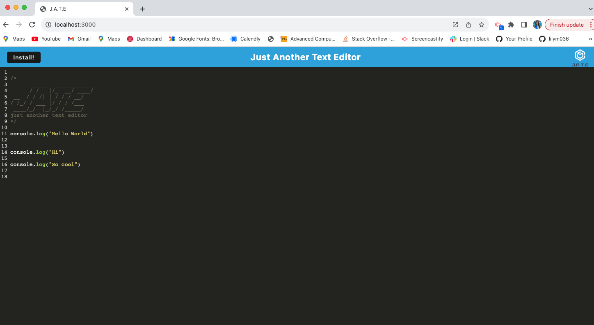
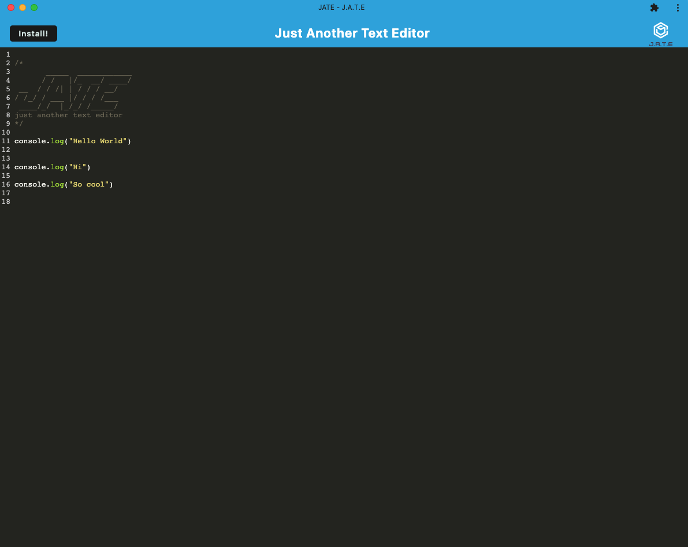

# text-editor

## Description
This project was created for developers and users to be able to create notes or code snippets with or without an internet connection so that the user can reliably retrieve them for later use. 

## Table of Contents 
- [Installation](#installation)
- [Usage](#usage)
- [Credits](#credits)
- [License](#license)

## Installation
The application can be used in the browser or downloaded locally. To use locally, click the download button. Follow the prompts and download to your computer. 

## Usage
Open the link below to open the application or download locally (refer to installation section for more information on downloading locally). Add text next to the numbers. The application will save your text. The application has the same functionality on the browser and when downloaded locally. 

Below are images of the application. The first image is what the application looks like in the browswer. The second image is how the application looks when it is downloaded locally. 

 

 

## Credits
None at this time. 

## License
MIT License

Copyright (c) 2023 Lilibeth Neal 

Permission is hereby granted, free of charge, to any person obtaining a copy
of this software and associated documentation files (the "Software"), to deal
in the Software without restriction, including without limitation the rights
to use, copy, modify, merge, publish, distribute, sublicense, and/or sell
copies of the Software, and to permit persons to whom the Software is
furnished to do so, subject to the following conditions:

The above copyright notice and this permission notice shall be included in all
copies or substantial portions of the Software.

THE SOFTWARE IS PROVIDED "AS IS", WITHOUT WARRANTY OF ANY KIND, EXPRESS OR
IMPLIED, INCLUDING BUT NOT LIMITED TO THE WARRANTIES OF MERCHANTABILITY,
FITNESS FOR A PARTICULAR PURPOSE AND NONINFRINGEMENT. IN NO EVENT SHALL THE
AUTHORS OR COPYRIGHT HOLDERS BE LIABLE FOR ANY CLAIM, DAMAGES OR OTHER
LIABILITY, WHETHER IN AN ACTION OF CONTRACT, TORT OR OTHERWISE, ARISING FROM,
OUT OF OR IN CONNECTION WITH THE SOFTWARE OR THE USE OR OTHER DEALINGS IN THE
SOFTWARE.